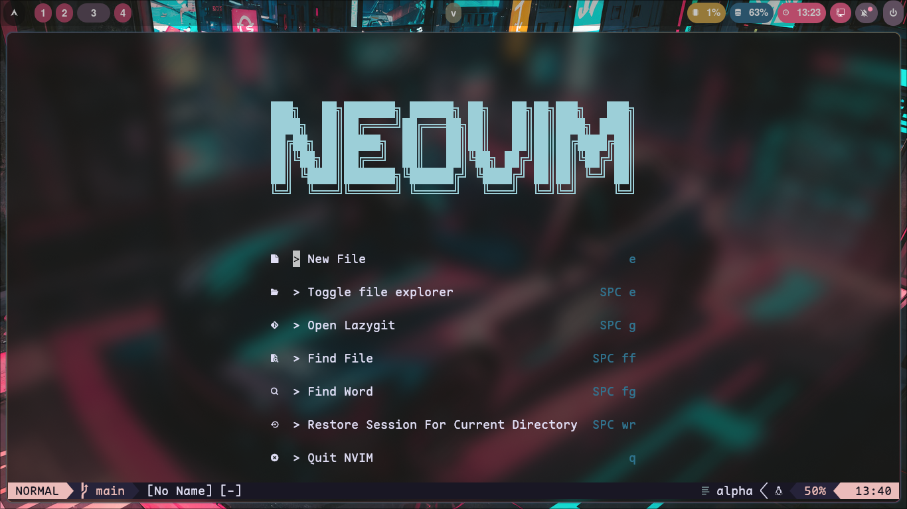
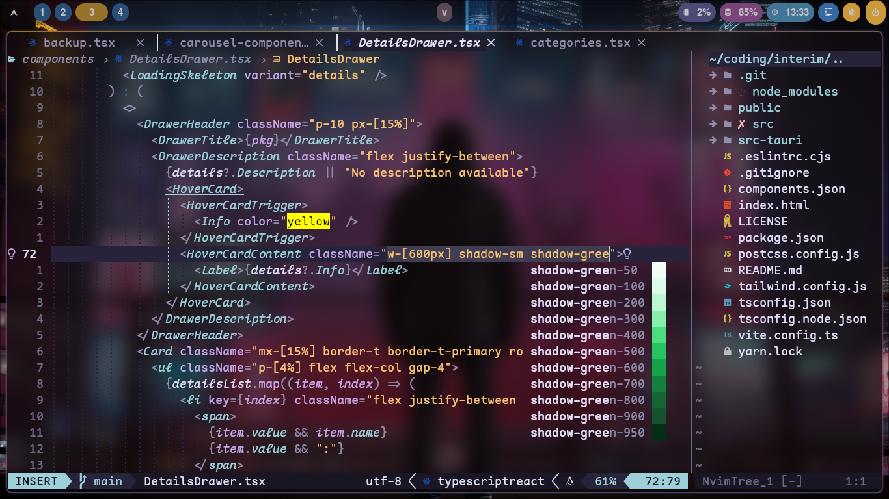

# Neovim Dotfiles Configuration

## Overview

This repository contains my personal Neovim configuration files, designed to enhance productivity and streamline my coding workflow. This setup is tailored for users who want a modern, efficient IDE like experience with Neovim.

## Screenshots




## Prerequisites

- **[nvim](https://github.com/neovim/neovim)**: Version 0.10 or higher.
- **[npm](https://github.com/npm/cli)** and **[nodejs](https://github.com/nodejs/node)**: Required for installing packages and plugins.
- **[deno](https://github.com/denoland/deno)** and **[webkit2gtk](https://webkitgtk.org)**: Required for markdown preview (peek).
- **[nerd-fonts](https://www.nerdfonts.com/)**: Required for the icons to display correctly.
- **[lazygit](https://github.com/jesseduffield/lazygit)**: Required for the lazygit plugin.
- **[fd](https://github.com/sharkdp/fd)**: Required for snacks.picker.explorer.
- **[ghostscript](https://www.ghostscript.com)**: Required for pdf preview plugin.

## To set up nvim configuration:

**Clone the Repository**:

```bash
git clone https://github.com/jude7733/nvim.git ~/.config/nvim
```

## Plugins used

### Plugin Manager

- **[lazy](https://github.com/folke/lazy.nvim)**: A modern plugin manager for Neovim.

### Snacks.nvim

- **[snacks](https://github.com/folke/snacks.nvim)**: A collection of QoL plugins for Neovim.

### LSP (Language Server Protocol)

- **[nvim-lspconfig](https://github.com/neovim/nvim-lspconfig)**: Configurations for Nvim LSP.
- **[lspsaga](https://github.com/nvimdev/lspsaga.nvim)**: Enhancements for LSP experience.
- **[Mason](https://github.com/williamboman/mason.nvim)**: Package manager for LSP servers and tools.
- **[typescript-tools](https://github.com/pmizio/typescript-tools.nvim)**: TypeScript support for Neovim.
- **[rustacianvim](https://github.com/mrcjkb/rustaceanvim)**: Supercharge your Rust experience in Neovim! A heavily modified fork of rust-tools.nvim.

### Debugging

- **[nvim-dap](https://github.com/mfussenegger/nvim-dap)**: Debug Adapter Protocol client implementation for Neovim.

### Autocompletion

- **[blink.cmp](https://github.com/Saghen/blink.cmp)**: Performant, batteries-included completion plugin.

### Git Integration

- **[lazygit](https://github.com/kdheepak/lazygit.nvim)**: Terminal UI for Git commands.
- **[gitsigns](https://github.com/lewis6991/gitsigns.nvim)**: Git integration with Neovim.

### UI Enhancements

- **[lualine](https://github.com/nvim-lualine/lualine.nvim)**: Status line plugin.
- **[nvim-web-devicons](https://github.com/nvim-tree/nvim-web-devicons)**: Icons for various file types.
- **[noice](https://github.com/folke/noice.nvim)**: Enhanced UI for messages, cmdline, and popup menu.
- **[indentscope](https://github.com/echasnovski/mini.nvim/blob/main/readmes/mini-indentscope.md)**: Provides indent guides
- **[nvim-colorizer](https://github.com/NvChad/nvim-colorizer.lua)**: Colorizer plugin for better color handling in code.
- **[vim-illuminate](https://github.com/RRethy/vim-illuminate)**: Highlight references to the word under the cursor.
- **[eyeliner](https://github.com/jinh0/eyeliner.nvim)**: Move faster with unique f/F indicators.
- **[nvim-dap-ui](https://github.com/rcarriga/nvim-dap-ui)**: A UI for nvim-dap.

### Color Schemes

- **[rose-pine](https://github.com/rose-pine/neovim)**: Soho vibes.
- **[tokyonight](https://github.com/folke/tokyonight.nvim)**: A clean, dark Neovim theme written in Lua.
- **[catppuccin](https://github.com/catppuccin/nvim)**: Soothing pastel theme.
- **[gruvbox](https://github.com/ellisonleao/gruvbox.nvim)**: Retro groove color scheme.
- **[nightfox](https://github.com/EdenEast/nightfox.nvim)**: A highly customizable theme for vim and neovim.
- **[kanagawa](https://github.com/rebelot/kanagawa.nvim)**: Dark colorscheme inspired by the colors of the famous painting by Katsushika Hokusai.
- **[flow](https://github.com/0xstepit/flow.nvim)**: Features carefully designed colors with fluorescent details to provide a vibrant environment.

### Code Editing Enhancements

- **[nvim-comment](https://github.com/terrortylor/nvim-comment)**: Commenting utility.
- **[treesitter](https://github.com/nvim-treesitter/nvim-treesitter)**: Syntax highlighting and code parsing.
- **[nvim-autopairs](https://github.com/windwp/nvim-autopairs)**: Automatically close pairs of characters.
- **[nvim-surround](https://github.com/kylechui/nvim-surround)**: Easily add, change or delete surrounding characters.
- **[vim-maximizer](https://github.com/szw/vim-maximizer)**: Maximize and restore windows easily.

### Session and Buffer Management

- **[auto-session](https://github.com/rmagatti/auto-session)**: Session management plugin.
- **[bufferline](https://github.com/akinsho/bufferline.nvim)**: Buffer management with a tab-like interface.

### AI and Productivity Tools

- **[copilot](https://github.com/zbirenbaum/copilot.lua)**: AI-powered code completion.
- **[copilot-chat](https://github.com/CopilotC-Nvim/CopilotChat.nvim)**: Github copilot chat inside nvim.

### Formatting and Linting

- **[conform](https://github.com/stevearc/conform.nvim)**: Code formatter.
- **[nvim-lint](https://github.com/mfussenegger/nvim-lint)**: Linting utility.

### Markdown Support

- **[peek](https://github.com/toppair/peek.nvim)**: Markdown preview plugin for Neovim.
- **[render-markdown](https://github.com/MeanderingProgrammer/render-markdown.nvim)**: Markdown rendering.

### Notifications and Diagnostics

- **[notify](https://github.com/rcarriga/nvim-notify)**: Notifications manager.
- **[trouble](https://github.com/folke/trouble.nvim)**: Diagnostic management tool.

### Additional Utilities

- **[todo-comments](https://github.com/folke/todo-comments.nvim)**: Highlight TODO comments in your code.
- **[w3m](https://github.com/yuratomo/w3m.vim)**: Inbuilt browser for viewing web pages from Neovim.
- **[which-key](https://github.com/folke/which-key.nvim)**: Keymap guide to display available keybindings.

## Customizations

- **Key Mappings**: Key mappings are defined in /lua/config/keymaps.lua (leader key is set to space)
- **Settings**: Settings are defined in /lua/config/options.lua
- **Auto Commands**: Custom auto commands are defined in /lua/config/autocmds.lua
